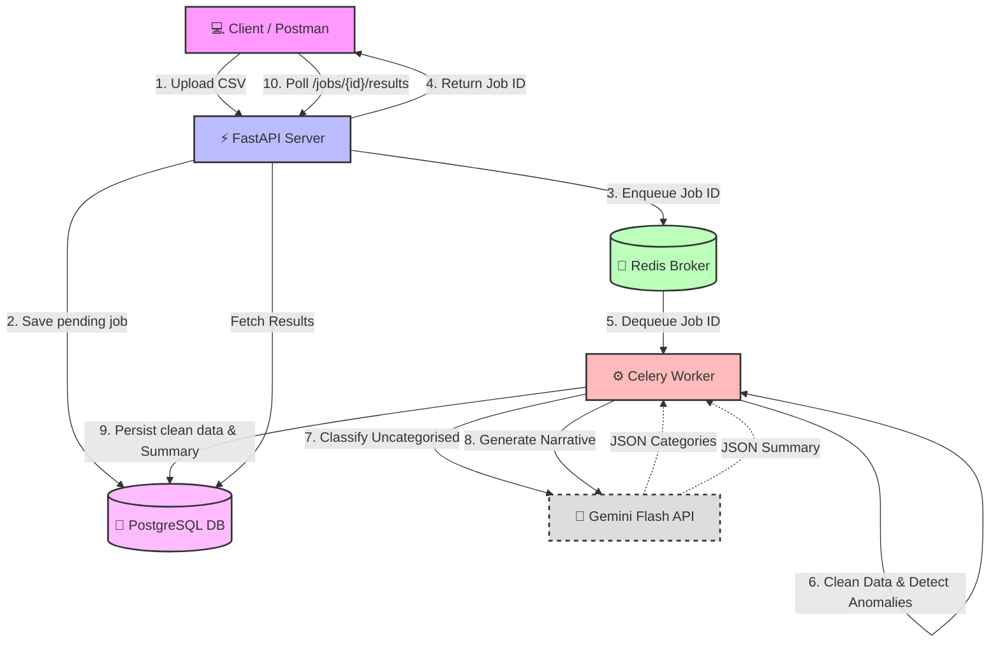

# 🚀 AI-Powered Transaction Processing Pipeline

Welcome to the backend architecture for the AI-Powered Transaction Processing Pipeline. This system handles raw, dirty financial CSV data, processes it asynchronously, flags anomalies, and leverages the free-tier Gemini API to categorize missing transactions and generate a human-readable financial narrative.

---

## 🏗 Project Architecture

This project is built using a modern, scalable backend stack.



---

## ⚙️ Environment Variables (`.env`)

Create a `.env` file in the root directory. To ensure the project uses the strictly **free-tier** version of Gemini, you just need a valid Google API key.

```env
# .env file structure
APP_NAME="Transaction Processing Pipeline"
DEBUG=True
API_HOST="0.0.0.0"
API_PORT=8000

# Database & Redis (Docker internal networking)
DATABASE_URL=postgresql://user:password@db:5432/transactions_db
REDIS_URL=redis://redis:6379/0

# Celery
CELERY_BROKER_URL=redis://redis:6379/0
CELERY_RESULT_BACKEND=redis://redis:6379/0

# Gemini API (Free Tier: gemini-1.5-flash)
GEMINI_API_KEY=your_actual_gemini_api_key_here
```

---

## 🚀 Running the Project

1. **Clone the repository** (or navigate to your directory).
2. **Create the `.env` file** matching the structure above.
3. **Start the infrastructure**:
   ```bash
   docker-compose up --build
   ```
   *(This brings up FastAPI, PostgreSQL, Redis, and the Celery Worker. Wait for the `database system is ready to accept connections` logs).*

4. **Run Database Migrations**:
   Open a second terminal window and run:
   ```bash
   docker-compose exec api alembic upgrade head
   ```

---

## 🧪 Testing the APIs & Sample Requests

The API runs on `http://localhost:8000`. You can use Postman, `curl`, or the interactive Swagger UI at `http://localhost:8000/docs`.

### 1. Upload a CSV (`POST /api/v1/jobs/upload`)

**Command:**
```bash
curl -X POST "http://localhost:8000/api/v1/jobs/upload" \
  -H "accept: application/json" \
  -H "Content-Type: multipart/form-data" \
  -F "file=@transactions.csv"
```
*(Make sure `transactions.csv` is in your current directory).*

**Expected Output:**
```json
{
  "filename": "transactions.csv",
  "status": "pending",
  "row_count_raw": 90,
  "row_count_clean": null,
  "id": "e22d9c4b-1234-4567-89ab-cdef01234567",
  "created_at": "2024-05-18T12:00:00.000000Z",
  "completed_at": null,
  "error_message": null
}
```

### 2. Poll Job Status (`GET /api/v1/jobs/{job_id}/status`)

**Command:**
*(Replace the UUID with the `id` from step 1)*
```bash
curl -X GET "http://localhost:8000/api/v1/jobs/e22d9c4b-1234-4567-89ab-cdef01234567/status" -H "accept: application/json"
```

**Expected Output:**
```json
{
  "job_id": "e22d9c4b-1234-4567-89ab-cdef01234567",
  "status": "completed",
  "row_count_raw": 90,
  "row_count_clean": 88,
  "error_message": null,
  "created_at": "2024-05-18T12:00:00.000Z",
  "completed_at": "2024-05-18T12:00:05.000Z"
}
```

### 3. Fetch Final Results (`GET /api/v1/jobs/{job_id}/results`)

Once the status is `"completed"`, fetch the final data!

**Command:**
```bash
curl -X GET "http://localhost:8000/api/v1/jobs/e22d9c4b-1234-4567-89ab-cdef01234567/results" -H "accept: application/json"
```

**Expected Output (Truncated):**
```json
{
  "job": { ... },
  "summary": {
    "total_spend_inr": 150450.50,
    "total_spend_usd": 450.00,
    "top_merchants": { "Swiggy": 12, "Amazon": 8, "Uber": 5 },
    "anomaly_count": 3,
    "narrative": "A majority of the spending this month occurred on food delivery and e-commerce platforms. There were three flagged statistical anomalies regarding high-value USD transactions.",
    "risk_level": "medium"
  },
  "cleaned_transactions": [
    {
      "txn_id": "txn-001",
      "date": "2024-05-01T00:00:00Z",
      "merchant": "Swiggy",
      "amount": 450.0,
      "currency": "INR",
      "status": "SUCCESS",
      "category": "Food",
      "is_anomaly": false,
      "llm_category": "Food"
    }
    // ... 87 more
  ],
  "anomalies": [
    // Flagged anomalous transactions
  ],
  "category_breakdown": {
    "Food": 15,
    "Shopping": 20,
    "Other": 53
  }
}
```

---

## 🗂 About `transactions.csv`
The included `transactions.csv` file is a dummy dataset designed specifically for this assignment. It contains intentionally "dirty" data (missing values, inconsistent currencies, duplicate rows, missing categories). **Its sole purpose is to be the payload you upload to the `/jobs/upload` API endpoint** to test the data cleaning pipeline, anomaly detector, and the Gemini-powered missing-category classification logic.
