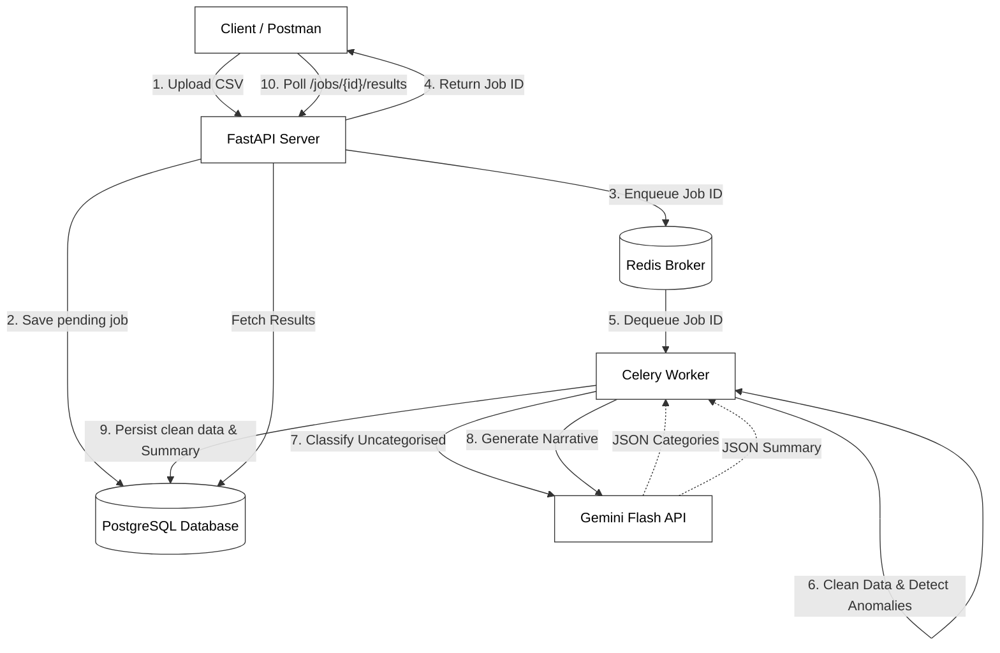

# AI-Powered Transaction Processing Pipeline

Welcome to the backend architecture for the AI-Powered Transaction Processing Pipeline. This system handles raw financial CSV data, processes it asynchronously, flags anomalies, and leverages the free-tier Gemini API to categorize missing transactions and generate a human-readable financial narrative.

---

## Project Architecture

This project is built using a modern, scalable backend stack. The diagram below illustrates the exact request lifecycle and data flow.



---

## Environment Variables

Create a `.env` file in the root directory. To ensure the project uses the free-tier version of Gemini, you need a valid Google API key. You do not need to create a `.env.example` file, simply copy the structure below into your `.env` file.

```env
APP_NAME="Transaction Processing Pipeline"
DEBUG=True
API_HOST="0.0.0.0"
API_PORT=8000

# Database & Redis (Docker internal networking)
DATABASE_URL=postgresql://user:password@db:5432/transactions_db
REDIS_URL=redis://redis:6379/0

# Celery
CELERY_BROKER_URL=redis://redis:6379/0
CELERY_RESULT_BACKEND=redis://redis:6379/0

# Gemini API (Free Tier: gemini-1.5-flash)
GEMINI_API_KEY=your_actual_gemini_api_key_here
```

---

## Running the Project

1. Create the `.env` file matching the structure above.
2. Start the infrastructure using Docker Compose. The database tables will be created automatically on startup.

```bash
docker compose up --build
```

*(This brings up FastAPI, PostgreSQL, Redis, and the Celery Worker. Wait for the application startup logs to indicate it is ready to accept connections).*

---

## Testing the APIs

The API runs on `http://localhost:8000`. You can use Postman, `curl`, or the interactive Swagger UI at `http://localhost:8000/docs`. Ensure `transactions.csv` is in your current directory before testing the upload.

### 1. Upload a CSV (Trigger the Job)
```bash
curl.exe -s -X POST "http://localhost:8000/api/v1/jobs/upload" -H "accept: application/json" -F "file=@transactions.csv"
```
*(Copy the `id` from the output of this command for the next steps)*

### 2. Check Job Status
Replace `<YOUR-JOB-ID>` with the ID you received in step 1.
```bash
curl.exe -s -X GET "http://localhost:8000/api/v1/jobs/<YOUR-JOB-ID>/status" -H "accept: application/json"
```

### 3. Fetch Final Results
Once the status is `completed`, fetch the final data.
```bash
curl.exe -s -X GET "http://localhost:8000/api/v1/jobs/<YOUR-JOB-ID>/results" -H "accept: application/json"
```

### 4. List All Jobs
List the history of jobs processed in the system.
```bash
curl.exe -s -X GET "http://localhost:8000/api/v1/jobs" -H "accept: application/json"
```

---

## About transactions.csv
The included `transactions.csv` file is a dataset designed specifically for this assignment. It contains intentionally dirty data (missing values, inconsistent currencies, duplicate rows, missing categories). Its sole purpose is to be the payload you upload to the `/jobs/upload` API endpoint to test the data cleaning pipeline, anomaly detector, and the Gemini-powered missing-category classification logic.

---

Developed by: Mahesh Shinde
